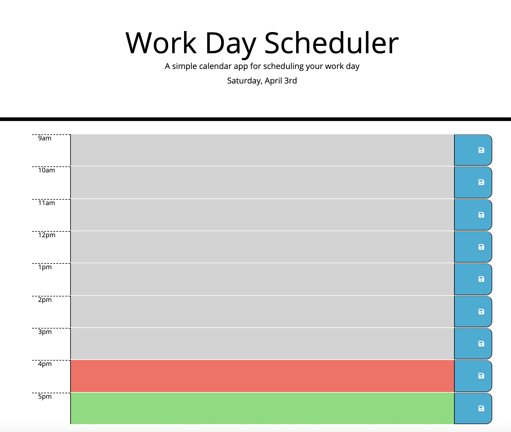

# Work_Day_Scheduler

## Description

I was tasked to create a dynamic work day scheduler, which allowed employees to plan out their day and add different scheduled tasks to hourly timeblocks.

Each timeblock had to enable the user to input their planned task(s) for the hour and click the save button on the corresponding timeblock row. This user input was then saved to local storage, so the user could refresh the page and see their planned task for a particular hour in the correct timeblock.

The work day scheduler utilised the Moment.js date and time utility library to dynamically show the current day and to dynamically colour-code the timeblock. This dynamic colour-coding depended on whether a timeblock hour was past, present or future in relation to the current time. Timeblocks relating to hours in the past were dynamically coloured grey, the timeblock relating to the current hour was coloured red, and any future timeblocks were dynamically coloured green.

These dynamic features helped to enhance the user experience, whilst helping the user to effectively manage their day.

## What did I do?

- Used Moment.js to dynamically show the current day's date
- Used Moment.js to retrieve the current time and conditionals to enable the timeblocks to be dynamically coloured coded, depending on whether that hour was past, present or future
- Used ES6 functions
- Used data attributes to assign a time value for each timeblock
- Created a onClick function and local storage so that when a save button for a timeblock was pressed, the user inputted text for that timeblock would be saved
- Created an onReady function so the calendar would load and dynamically retrieve the current date, the timeblocks, and any saved scheduled events for that date
-

## Screenshot

## Link to deployed application:

https://gemmac-coder.github.io/Work_Day_Scheduler/
